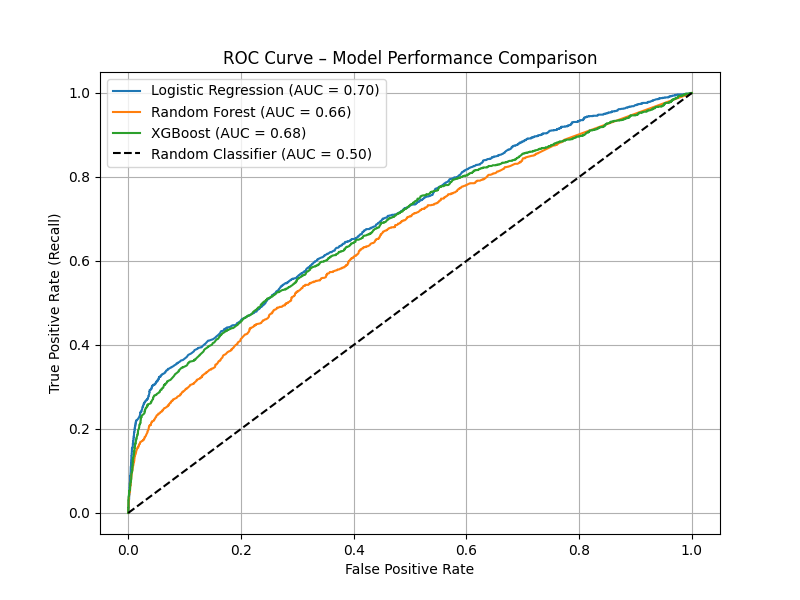

# Project Title: Predicting Term Deposit Subscriptions
### AIAPⓇ Batch 20 Technical Assessment 

## Project Description
As a new member of the AI Data Science and Engineering team at AI-Vive-Banking, I developed predictive models to identify clients most likely to subscribe to term deposits based on demographic data and marketing campaign history. I began with exploratory data analysis in eda.ipynb to uncover key patterns, detect anomalies, and guide preprocessing. Using the provided dataset, I then built and evaluated three classification models and identified key features driving predictions. This project aims to improve campaign targeting and optimize marketing resources.


## File Structure
````
project_folder/
│
├── eda.ipynb               # Exploratory Data Analysis notebook
├── run.sh                  # Shell script to execute the full ML pipeline
├── requirements.txt        # Python package dependencies
├── outputs/                # Folder to store generated outputs (e.g., models, reports)
├── README.md               # Project documentation
└── src/                    # Source code for data processing and model pipeline
    ├── config.py           # Configuration settings (paths, parameters)
    ├── data_loader.py      # Functions to load and split the dataset
    ├── preprocess.py       # Data cleaning and feature engineering
    ├── model.py            # Model training, evaluation
└── venv (upon installation) # Virtual Environment, not tracked in Git.
````

### eda.ipynb
Before opening eda.ipynb, run "install_venv.sh" to setup the Virtual Environment (venv folder will be installed in the project folder)

## Data Preprocessing
The ````preprocess.py```` script handles data cleaning, transformation, and feature engineering before feeding it into machine learning models. The main steps include:

### 1. Feature Selection
- Only important features identified during EDA are retained:
````
Age
Occupation
Campaign Calls
Previous Contact Days
Credit Default
Subscription Status (target)
````
### 2. Cleaning Steps

- Removed " years" suffix from Age and converted it to integer.

- Capped Age at 100 to remove outliers.

- Standardized job titles (e.g., "admin." → "administrator").

- Dropped records with negative Campaign Calls.

- Replaced 999 in Previous Contact Days with -1, and added a new binary feature No Previous Contact.

- Mapped categorical responses (yes, no, unknown) in Subscription Status and Credit Default to numeric values using label encoding.

### 3. Preprocessing
- Applied StandardScaler to numerical features.

- Applied OneHotEncoder to categorical features using ColumnTransformer.

- Retained feature names for model interpretation.

### 4. Handling Class Imbalance
- Applied SMOTE (Synthetic Minority Oversampling Technique) to balance classes in the training set.

## Model Training & Evaluation
The ````model.py```` script trains and evaluates multiple classification models to predict whether a customer subscribes to a term deposit.

### 1. Trained Models
- Logistic Regression

    - Handles class imbalance via class_weight='balanced'.

- Random Forest Classifier
    - Trained on SMOTE-resampled data.
    - Captures non-linear relationships and feature interactions.

- XGBoost Classifer
    - Trained on SMOTE-resampled data.
    - Robust gradient-boosted model with scale_pos_weight for imbalance handling.

### 2. Evaluation Metrics
For each model, the script prints:

- Classification Report (Precision, Recall, F1-score)

- ROC AUC Score

- Top 10 Most Important Features (based on model explainability techniques)

### Evaluation Metrics Explained:
**Accuracy**

This measures the overall percentage of correct predictions (both true positives and true negatives) made by the model. It's useful for assessing how often the model is right, but it can be misleading if the data is imbalanced (e.g., when one class is much more frequent than the other).

**Recall**

This shows how well the model identifies the positive class (in this case, subscribers). A higher recall means fewer actual subscribers are missed. It’s important when it’s critical to catch as many positives as possible, even if it means some false positives.

**ROC AUC**

The ROC (Receiver Operating Characteristic) curve plots the true positive rate (recall) against the false positive rate. 

The AUC (Area Under the Curve) measures how well the model distinguishes between the positive and negative classes. **A higher AUC means better performance**.

**F1-Score**

This is the harmonic mean of precision and recall, giving a balance between the two. A higher F1-score indicates a model with both high precision (correct positive predictions) and high recall (capturing most positive instances). It's especially useful when the classes are imbalanced.

**Precision**

Precision measures how many of the predicted positive cases were actually positive. In other words, it tells us how many of the predicted subscribers were truly subscribers. It’s important when false positives (predicting a subscriber when they’re not) are costly or undesirable.

**Macro Average**

The macro average calculates the metric (e.g., recall, precision, F1-score) for each class individually and then averages them. This method treats all classes equally, regardless of how many instances there are in each class. It is useful when we want to treat all classes as equally important.

**Weighted Average**

The weighted average computes the metric for each class and then averages them, but it weights each class by the number of instances in that class. This gives more importance to classes with more instances and is helpful when we want to reflect the true distribution of the classes.


### 3. Model Comparison
All models are compared using a single ROC Curve plot, which is saved as:

````output/roc_curve_comparison.png````

## Why These 3 Models Were Selected
The target variable, Subscription Status, is categorical (binary), indicating whether a customer subscribed or not. Therefore, classification models are appropriate. The following three models were selected to balance interpretability, baseline comparison, and high performance:

### 1. Logistic Regression
A baseline linear classifier well-suited for binary classification tasks.

Offers high interpretability, making it ideal for understanding how each feature affects the prediction.

### 2. Random Forest
An ensemble of decision trees designed to reduce overfitting by averaging multiple trees.

Captures non-linear relationships and interactions between features.

### 3. XGBoost
A high-performance gradient boosting algorithm that often outperforms other models in classification tasks.

Especially useful for imbalanced datasets with options like scale_pos_weight.

## Understanding FP & TP
- Class 1 = Customer will respond positively (e.g., subscribe to product)
- Class 0 = Customer will not respond

- True Positive (TP): Model correctly predicts Class 1 (e.g., customer will subscribe)
- False Positive (FP): Model incorrectly predicts Class 1 (predicts "yes", but actual is "no")
- True Negative (TN): Model correctly predicts Class 0 (e.g., customer will not subscribe)
- False Negative (FN): Model incorrectly predicts Class 0 (predicts "no", but actual is "yes")

**False Positives (FP):**
- The model says a customer will say “yes”, but they actually say “no”.
- In marketing: You target them with resources (calls, emails), but they don’t convert.
- Cost : Wasted effort, possible annoying to customers.

**True Positives (TP):**
- The model correctly identifies someone who will respond positively.
- Benefit : Successful conversion, ROI on marketing spend.

## Business Goal 
- Maximizing True Positives (catch as many real responders as possible)
- Minimizing False Positives (don’t waste time/money on people who won’t convert)

## Model Evaluation
Three models were trained and evaluated on the test dataset to predict Subscription Status for a term deposit marketing campaign. The metrics below focus on class imbalance, particularly improving recall for the positive class (i.e., customers who subscribed).

### Understanding Evaluation Matrix

**Recall = TP / (TP + FN)**
- Measures how many of the actual positive cases were caught by the model.
- High recall → fewer false negatives.

**Precision = TP / (TP + FP)**
- Measures how many selected positives are actually correct.
- High precision → fewer false positives.

### Model Comparison


### Logistic Regression 
````
Evaluation Metrics:
Accuracy: 73%
ROC AUC: 0.70
F1-score (Class 1): 0.30
Recall (Class 1): 0.50
Precision: 0.21

Top 10 Important Features:
Occupation_student          0.920935
Occupation_retired          0.668492
Credit Default              0.288192
Occupation_unknown          0.258578
Occupation_unemployed       0.064127
Age                         0.039124
Occupation_administrator   -0.001185
Previous Contact Days      -0.034501
Occupation_self-employed   -0.132387
Occupation_management      -0.158504
````

### Random Forest
````
Evaluation Metrics:
Accuracy: 77%
ROC AUC: 0.66
F1-score (Class 1): 0.28
Recall (Class 1): 0.38
Precision: 0.22

Top 10 Important Features:
Age                         0.577872
Campaign Calls              0.176726
Previous Contact Days       0.074772
No Previous Contact         0.061364
Credit Default              0.032616
Occupation_student          0.012716
Occupation_blue-collar      0.011269
Occupation_retired          0.010149
Occupation_administrator    0.008518
Occupation_services         0.005334
````

### XGBoost
````
Evaluation Metrics:
Accuracy: 30%
ROC AUC: 0.68
F1-score (Class 1): 0.23
Recall (Class 1): 0.89
Precision: 0.13

Top 10 Important Features:
Previous Contact Days       0.166599
Credit Default              0.094491
Age                         0.084840
Occupation_student          0.078155
Occupation_blue-collar      0.072233
Campaign Calls              0.070041
Occupation_administrator    0.066211
Occupation_management       0.050423
Occupation_services         0.047593
Occupation_technician       0.047159
````


## Model Analysis
We evaluated three models, Logistic Regression, Random Forest, and XGBoost to predict customer subscription to a term deposit product.

| Model               | Accuracy | Recall (Subscribed)  | Precision (Subscribed)  | ROC AUC |
|---------------------|----------|----------------------|-------------------------|---------|
| Logistic Regression | 0.73     | 0.50                 | 0.21                    | 0.70    |
| Random Forest       | 0.77     | 0.38                 | 0.22                    | 0.66    |
| XGBoost             | 0.30     | 0.89                 | 0.13                    | 0.68    |

In business terms, recall is more critical than precision for our campaign goal, which is to maximize outreach to potential subscribers. 

A higher recall (true positive rate) ensures we identify more of the truly interested customers, even if it means accepting some false positives (people who are wrongly predicted as likely to subscribe). 

This aligns with marketing objectives where missing a potential subscriber (false negative) has a higher cost than following up with someone uninterested.

### Why We Chose Logistic Regression
While XGBoost shows the highest recall (0.89), it comes at a very high cost to precision (0.13) and overall accuracy (0.30). 
This means it flags almost everyone as a potential subscriber, resulting in a high false positive rate. 
For the business, this would translate into wasted resources contacting large numbers of uninterested customers.

On the other hand, Logistic Regression offers a balanced and practical trade-off:

Reasonable recall (0.50) to capture half the real subscribers.
Much better accuracy (0.73) and precision (0.21) making it a more trustworthy signal for campaign planning.
Best ROC AUC (0.70), reflecting solid overall model performance across thresholds.

## Focus Group
**Top drivers identified by the model:**

**Occupation**: students, retirees. This is also noticeable in EDA that they have higher rates of conversion.

**Credit Default**: customer with no history of credit default.

**Previous Contact Days**: recently contacted leads are more likely to convert.

**Age**: Younger and older customers respond differently. Based on EDA, we identify that younger customers are more likely to convert and conversion rate decreases with age.

## Reference

### Precision, Recall, ROC
https://builtin.com/data-science/precision-and-recall
https://www.v7labs.com/blog/f1-score-guide

### Sklearn Metrics
https://scikit-learn.org/stable/api/sklearn.metrics.html

### Classification Report
https://scikit-learn.org/stable/modules/generated/sklearn.metrics.classification_report.html#sklearn.metrics.classification_report

### Google Machine Learning Crash Course
https://developers.google.com/machine-learning/crash-course/classification

### Google Advanced Data Analytics Course
05. Regression Analysis Simplify Complex Data Relationships
06. The Nuts and Bolts of Machine Learning
Reference-guide_-XGBoost-tuning
Reference-guide_-Random-forest-tuning
